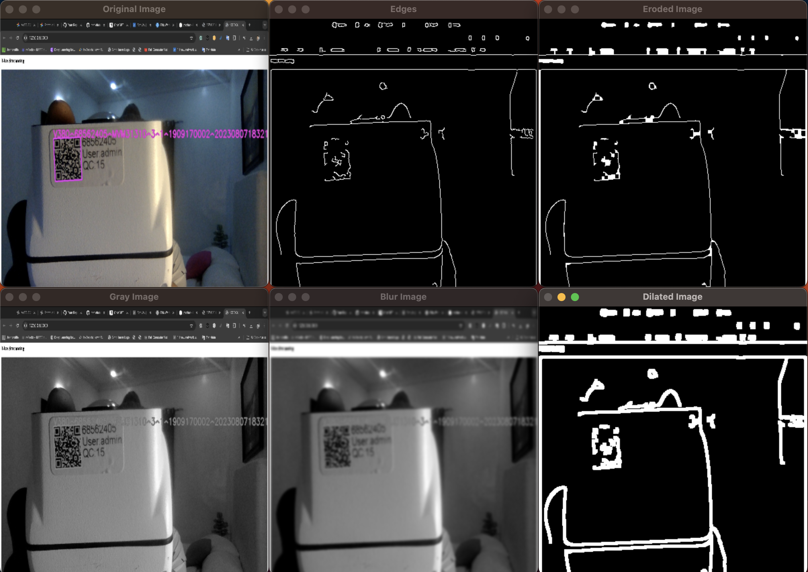

# Image Processor

The **Image Processor** is a Python application for performing a series of image processing operations using OpenCV. This includes resizing, converting to grayscale, applying Gaussian blur, edge detection, dilation, and erosion. The class-based design provides a clear structure for loading, processing, and displaying images.



## Features

- **Load Image**: Load an image from a specified file path.
- **Resize Image**: Resize the image to specified dimensions.
- **Convert to Grayscale**: Convert the image to grayscale.
- **Apply Blur**: Apply Gaussian blur to the image.
- **Detect Edges**: Detect edges using the Canny edge detector.
- **Dilate Image**: Dilate edges to make them more prominent.
- **Erode Image**: Erode the dilated edges to refine them.
- **Display Images**: Display all processed images including the original.

## Requirements

- Python 3.x
- OpenCV (`opencv-python`)
- NumPy (`numpy`)

You can install the required Python packages using pip:

```bash
pip install opencv-python numpy
```

## Usage

1. **Clone the Repository**

   ```bash
   git clone https://github.com/yourusername/image-processor.git
   cd image-processor
   ```

2. **Update the Image Path**

   Open `image_processor.py` and update the `image_path` variable with the path to your image file.

   ```python
   image_path = "C:\\path\\to\\your\\image.jpeg"
   ```

3. **Run the Script**

   Execute the script to perform the image processing operations and display the results.

   ```bash
   python image_processor.py
   ```

## Code Overview

### `ImageProcessor` Class

- **`__init__(self, image_path: str)`**: Initializes the class with the path to the image file.
- **`load_image(self) -> None`**: Loads the image from the specified path.
- **`resize_image(self, width: int = 200, height: int = 200) -> None`**: Resizes the image.
- **`convert_to_grayscale(self) -> None`**: Converts the image to grayscale.
- **`apply_blur(self, kernel_size: Tuple[int, int] = (7, 7)) -> None`**: Applies Gaussian blur to the image.
- **`detect_edges(self, threshold1: int = 100, threshold2: int = 200) -> None`**: Detects edges in the image using the Canny edge detector.
- **`dilate_image(self, iterations: int = 1) -> None`**: Dilates the edges.
- **`erode_image(self, iterations: int = 1) -> None`**: Erodes the dilated edges.
- **`display_images(self) -> None`**: Displays all processed images including the original.

## License

This project is licensed under the MIT License. See the [LICENSE](LICENSE) file for details.

## Acknowledgments

- [OpenCV](https://opencv.org/) for image processing functionalities.
- [NumPy](https://numpy.org/) for numerical operations.

## Contact

For any questions or suggestions, feel free to contact me at danielsamueletukudo@gmail.com


